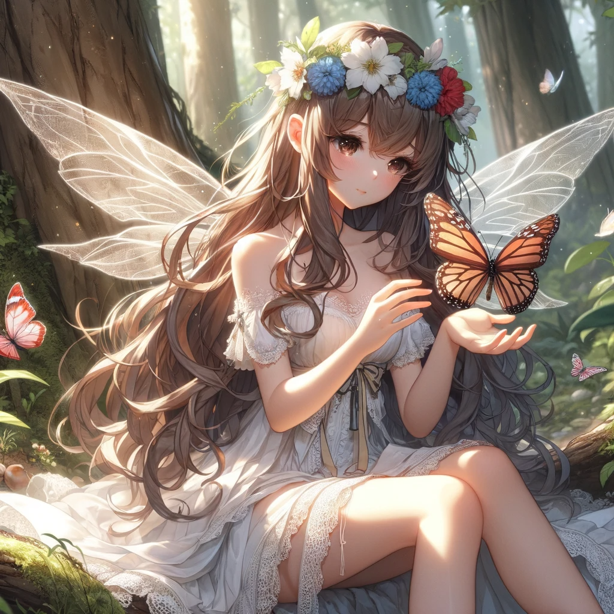
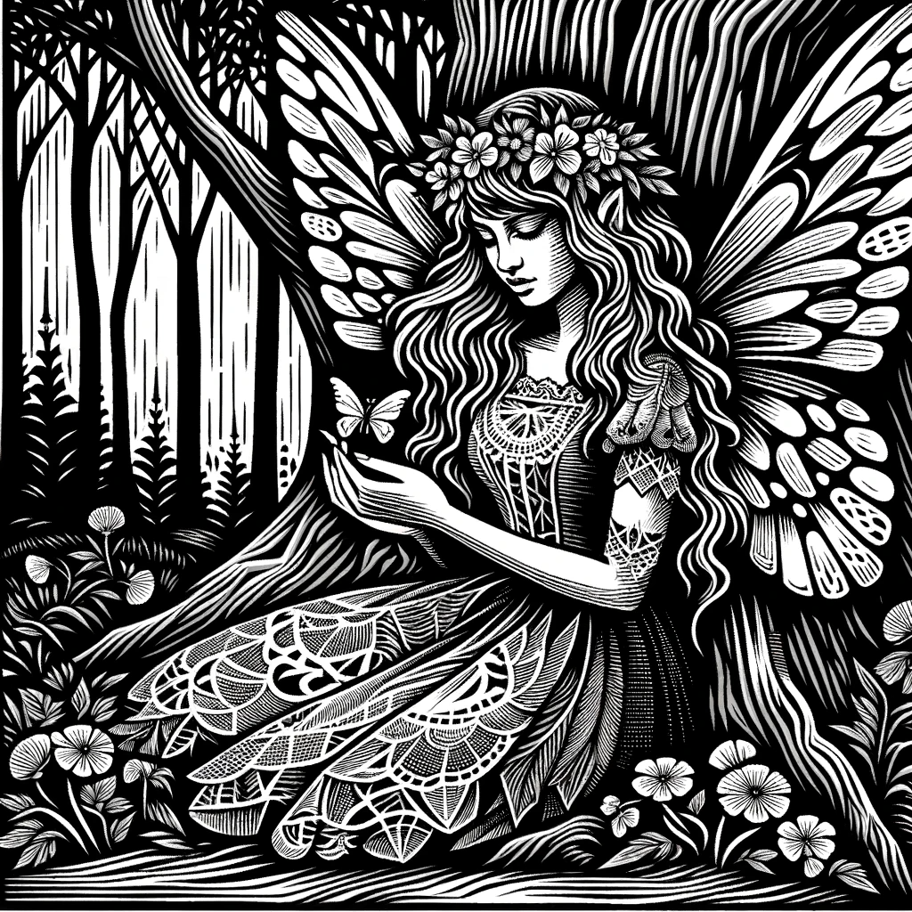

# Creative Imaginator
This tool performs transformation on a given image to a new one using multimodal LLMs. 

## Target audience
This tool is intended for those who are looking for an easy way to create DALL-E images, but don't want to be bothered with learning how to craft elaborate prompts. \
 
More specifically, this tool offers the following benefits:

- **Easy to use**. A user uplaods an image, select one of the serveral predefined styles/effects, and this tool will then proceed to re-imagine many aspects of the given image to create a new one. 
- Produces creative results within the bounds of the given image. This tool first converts the given image to text (which removes many visual details), then recreates new visual details following the guidance of the text and the selected style.\
\
Note that this tool is not intended for doing style transfer. For example, if you wish to convert your mugshot to have a certain particular style (e.g., cartoonized, impressionist, pencil drawing, etc.) while keeping face recognizable as you, then this tool is not for you.
- **Supports incremental refinement**. For example, once you have the following image created with this tool:\
\
then if you enter additional text instruction "redo the image with calla lilies in the background", then you may get something similar to the following:\
\
It is worth noting that while many aspects of this image is different from the last one, such as compsition, posture, details in clothing, etc., much of the general style and character features are preserved.
- **Style composition**. It is easy to combine multiple effects in order to achieve more complex transformation. For example, given the following start image:\
\
we can turn it into the following:\
\
This is achieved by first applying the Simpsons effect on the starting image to get this:
\
then apply the Biomechanical Sculpture effect.

## Live demo using a [Custom GPT](https://chat.openai.com/g/g-UpQkvuX7j-creative-imaginator) in OpenAI's GPT Store
Click on [this link](https://chat.openai.com/g/g-UpQkvuX7j-creative-imaginator) to open our custom GPT in your browser, and from there you will be able to upload your images and convert them to exciting art works!
 Please note as of January 2024, OpenAI still requires that you must have a GPT Plus subscription in order to access any GPT in their store. 

<!--
## How it works
This Custom GPT uses a given image as the inspiration for creating a new image, with the following steps:

* User provides an image
* A detailed textual description is extracted from the given image using OpenAI's multimodal GPT-4 model
* User selects the desired effect/style from a given list
* The extractd text and the given style are combined and given to OpenAI's DALL-E to generate an image.

This approach allows user to have control of the image generation process without having to learn prompt engineering, while still able to produce exciting images.
-->

## Supported artistic styles
* Paper collage
* Japanese anime
* Pop art comic
* Simpsons
* Woodcut
* Glass sculpture
* Biomechanical sculpture
* Milk sculpture

## Effects demonstration
Each column below is a demo series to showcase the effects.

<table style="border-collapse:unset;">
  <tr>
    <td>DEMO-1</td>
    <td>DEMO-2</td>
  </tr>
  <tr>
    <td></td>
    <td></td>
  </tr>
  <tr>
    <td style="border-bottom:none;"> Original Image</td>
    <td style="border-bottom:none;"> Original Image</td>
  </tr>
  <tr>
    <td></td>
    <td></td>
  </tr>
  <tr>
    <td> Paper collage</td>
    <td> Paper collage</td>
  </tr>
  <tr>
    <td></td>
    <td></td>
  </tr>
  <tr>
    <td> Japanese anime</td>
    <td> Japanese anime</td>
  </tr>
  <tr>
    <td></td>
    <td></td>
  </tr>
  <tr>
    <td> Pop art comics</td>
    <td> Pop art comics</td>
  </tr>
  <tr>
    <td></td>
    <td></td>
  </tr>
    <td> Simpsons</td>
    <td> Simpsons</td>
  </tr>
  <tr>
    <td></td>
    <td></td>
  </tr>
  <tr>
    <td> Woodcut</td>
    <td> Woodcut</td>
  </tr>
  <tr>
    <td></td>
    <td></td>
  </tr>
  <tr>
    <td> Glass sculpture</td>
    <td> Glass sculpture</td>
  </tr>
  <tr>
    <td></td>
    <td></td>
  </tr>
  <tr>
    <td> Biomechanical sculpture</td>
    <td> Biomechanical sculpture</td>
  </tr>
  <tr>
    <td></td>
    <td></td>
  </tr>
  <tr>
    <td> Milk sculpture</td>
    <td> Milk sculpture</td>
  </tr>
</table>

## Gallery

Each row below is a pair of images showcasing interesting transformation achieved during our experimentation.

<table>
  <tr>
    <td> Original Image</td>
    <td> Transformed: Paper collage</td>
  </tr> 
  <tr>
    <td></td>
    <td></td>
  </tr>
  <tr>
    <td> Original Image</td>
    <td> Transformed: Milk sculpture</td>
  </tr>
  <tr>
    <td></td>
    <td></td>
  </tr>
  <tr>
    <td> Original Image</td>
    <td> Transformed: Glass sculpture</td>
  </tr>
  <tr>
    <td></td>
    <td></td>
  </tr>
  <tr>
    <td> Original Image</td>
    <td> Transformed: Glass sculpture</td>
  </tr>
  <tr>
    <td></td>
    <td></td>
  </tr>
  <tr>
    <td> Original Image</td>
    <td> Transformed: Biomechanical sculpture</td>
  </tr> 
  <tr>
    <td></td>
    <td></td>
  </tr>
  <tr>
    <td> Original Image</td>
    <td> Transformed: Paper collage</td>
  </tr> 
  <tr>
    <td></td>
    <td></td>
  </tr>
  <tr>
    <td> Original Image</td>
    <td> Transformed: Glass sculpture</td>
  </tr>
  <tr>
    <td></td>
    <td></td>
  </tr>
  <tr>
    <td> Original Image</td>
    <td> Transformed: Glass sculpture</td>
  </tr> 
</table>

<!--
## A note to Gen-AI practioners

We believe that beyond fun and creative pursue, this image-to-text-to-image approach can find useful technical applications in the realm of Gen-AI development.

Let's say we have a multimodal LLM for converting image to text, 
-->
