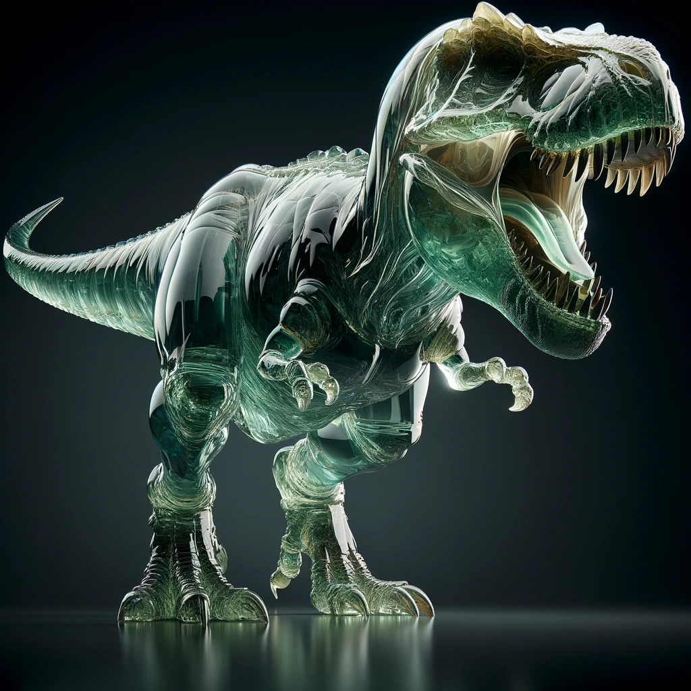

# Creative Imaginator
Perform artistic transformation on a given image using multimodal LLMs

## Live demo using a [Custom GPT](https://chat.openai.com/g/g-UpQkvuX7j-creative-imaginator) in OpenAI's GPT Store
Click on [this link](https://chat.openai.com/g/g-UpQkvuX7j-creative-imaginator) to open our custom GPT in your browser, and from there you will be able to upload your images and convert them to exciting art works!
 Please note as of January 2024, OpenAI still requires that you must have a GPT Plus subscription in order to access any GPT in their store. 

## How it works
This Custom GPT uses a given image as the inspiration for creating a new image, with the following steps:

* User provides an image
* A detailed textual description is extracted from the given image using OpenAI's multimodal GPT-4 model
* User selects the desired effect/style from a given list
* The extractd text and the given style are combined and given to OpenAI's DALL-E to generate an image.

This approach allows user to have control of the image generation process without having to learn prompt engineering, while still able to produce exciting images.

## Supported artistic styles
* Paper collage
* Japanese anime
* Pop art comic
* Simpsons
* Woodcut
* Glass sculpture
* Biomechanical sculpture
* Milk sculpture

## What this is not
This custom GPT is not meant for use as a beauty filter of style changer for human portraits, since the transformed face may not resemble the original.

## Effect demonstration
<table>
  <tr>
    <td>Image</td>
    <td>Notes</td>
  </tr>
  <tr>
    <td>
      
    </td>
    <td>Original Image</td>
  </tr>
  <tr>
    <td></td>
    <td>Effect: Paper collage</td>
  </tr>
  <tr>
    <td></td>
    <td>Effect: Japanese anime</td>
  </tr>
  <tr>
  <tr>
    <td></td>
    <td>Effect: Pop art comics</td>
  </tr>
    <td></td>
    <td>Effect: Simpsons</td>
  </tr>
  <tr>
    <td></td>
    <td>Effect: Woodcut</td>
  </tr>
  <tr>
    <td></td>
    <td>Effect: Glass sculpture</td>
  </tr>
  <tr>
    <td></td>
    <td>Effect: Biomechanical sculpture</td>
  </tr>
  <tr>
    <td></td>
    <td>Effect: Milk sculpture</td>
  </tr>
</table>

## Gallery

<table>
  <tr>
    <td>Original Image</td>
    <td>Transformed image</td>
    <td>Effect applied</td>
  </tr>
  <tr>
    <td></td>
    <td></td>
    <td>Paper collage</td>
  </tr>
  <tr>
    <td></td>
    <td></td>
    <td>Milk sculpture</td>
  </tr>
  <tr>
    <td></td>
    <td></td>
    <td>Glass sculpture</td>
  </tr>
  <tr>
    <td></td>
    <td></td>
    <td>Glass sculpture</td>
  </tr>
  <tr>
    <td></td>
    <td></td>
    <td>Effect: Biomechanical sculpture</td>
  </tr>  
  <tr>
    <td></td>
    <td></td>
    <td>Effect: Paper collage</td>
  </tr> 
  <tr>
    <td></td>
    <td></td>
    <td>Effect: Glass sculpture</td>
  </tr>  
  <tr>
    <td></td>
    <td></td>
    <td>Effect: Glass sculpture</td>
  </tr>  
</table>
