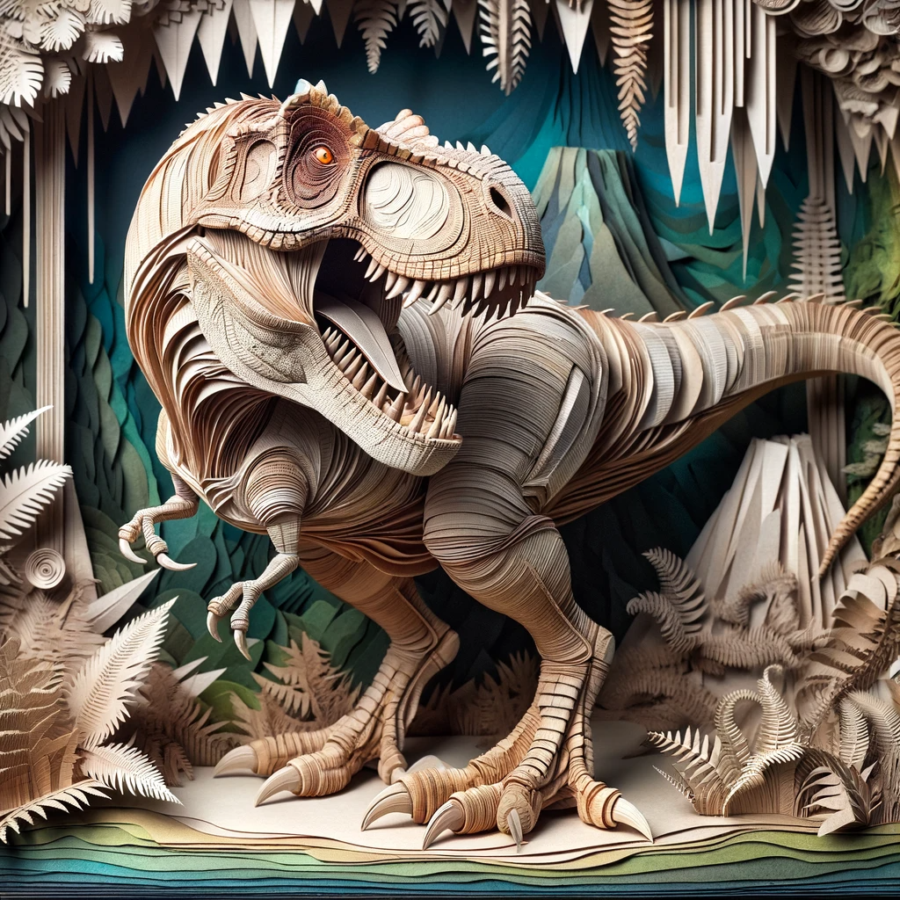

# ArtisticTransformer
Perform artistic transformation on a given image using multimodal LLMs

## Live demo as an [OpenAI GPT](https://chat.openai.com/g/g-UpQkvuX7j-artistic-transformer)
Using this custom GPT to upload your images and convert them to new art work!

## How it works
The OpenAI GPT model is used to find detailed descriptions from the given image, then the OpenAI DALL-E is used to generate new image per user's directions.

## Supported artistic styles
* Paper diorama collage
* Japanese anime
* Pop art comic
* Simpsons
* Woodcutting template
* Glass sculpture
* Fractal sculpture
* Milk sculpture. 

## What this is not
The custom GPT is not meant for use as a beauty filter for human portraits, since the transformed face may not resemble the original.
It is also not like the typical style transfer tools that change the visual style of a give image, since many aspects of the original image are re-imagined by AI. 

## Gallery
<table>
  <tr>
    <td>Image</td>
    <td>Notes</td>
  </tr>
  <tr>
    <td>
      
    </td>
    <td>User Image</td>
  </tr>
  <tr>
    <td>
      
    </td>
    <td>Effect: diorama paper collage</td>
  </tr>
</table>
