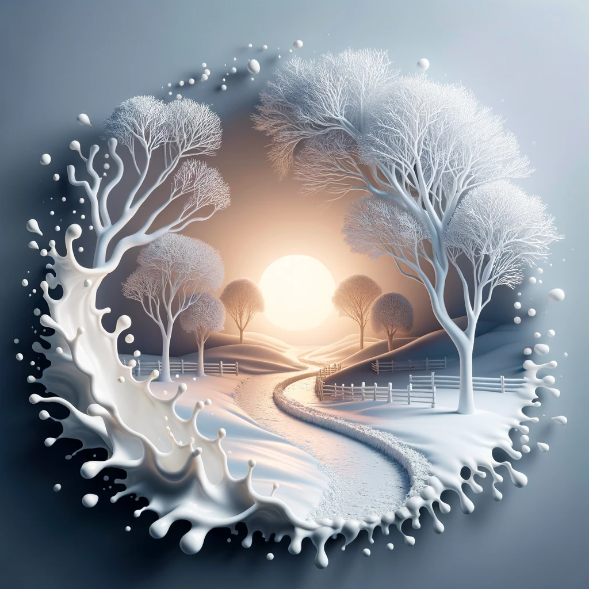

# Artistic Transformer
Perform artistic transformation on a given image using multimodal LLMs

## Live demo as an [OpenAI GPT](https://chat.openai.com/g/g-UpQkvuX7j-artistic-transformer) in OpenAI's GPT Store
Click on [this link](https://chat.openai.com/g/g-UpQkvuX7j-artistic-transformer) to open our custom GPT in your browser, and from there you will be able to upload your images and convert them to exciting art works!
Please note as of January 2024, OpenAI still requires that you must have a subscription to the GPT Plus in order to access any GPT in their store. 

## How it works
The OpenAI GPT model is used to find detailed descriptions from the given image, then the OpenAI DALL-E is used to generate new image per user's directions.

## Supported artistic styles
* Paper diorama collage
* Japanese anime
* Pop art comic
* Simpsons
* Woodcutting template
* Glass sculpture
* Fractal sculpture
* Milk sculpture. 

## What this is not
This custom GPT is not meant for use as a beauty filter for human portraits, since the transformed face may not resemble the original.
It is also not like the typical style transfer tools that change the visual style of a give image, since many aspects of the original image are re-imagined by AI even if its essence are preserved.

## Effect demonstration
<table>
  <tr>
    <td>Image</td>
    <td>Notes</td>
  </tr>
  <tr>
    <td>
      
    </td>
    <td>Original Image</td>
  </tr>
  <tr>
    <td></td>
    <td>Effect: diorama paper collage</td>
  </tr>
  <tr>
    <td></td>
    <td>Effect: Japanese anime</td>
  </tr>
  <tr>
  <tr>
    <td></td>
    <td>Effect: Pop art comics</td>
  </tr>
    <td></td>
    <td>Effect: Simpsons</td>
  </tr>
  <tr>
    <td></td>
    <td>Effect: Woodcut</td>
  </tr>
  <tr>
    <td></td>
    <td>Effect: Glass sculpture</td>
  </tr>
  <tr>
    <td></td>
    <td>Effect: Fractal sculpture</td>
  </tr>
  <tr>
    <td></td>
    <td>Effect: Milk sculpture</td>
  </tr>  
</table>

## Gallery

<table>
  <tr>
    <td>Given Image</td>
    <td>Transformed image</td>
    <td>Effect applied</td>
  </tr>
  <tr>
    <td></td>
    <td></td>
    <td>Paper collage</td>
  </tr>
  <tr>
    <td></td>
    <td></td>
    <td>Milk sculpture</td>
  </tr>
  <tr>
    <td></td>
    <td></td>
    <td>Glass sculpture</td>
  </tr>
  <tr>
    <td></td>
    <td></td>
    <td>Fractal sculpture</td>
  </tr>
</table>
